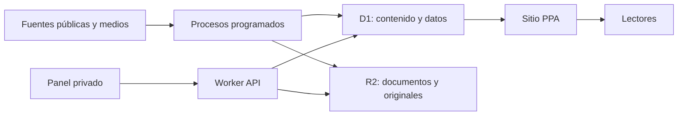

# Arquitectura Cloudflare

Estado: decisión de dirección, pendiente de diseño técnico detallado.

## 1. Principios

- Costos mínimos.
- Sitio público rápido y mayormente estático.
- Datos y edición separados de la presentación.
- Ninguna contraseña dentro del navegador.
- Historial de datos y cambios.
- Recolección pesada fuera del límite gratuito de Workers.
- Posibilidad de abandonar un servicio sin perder contenidos.

## 2. Componentes

## 3. Sitio público

Cloudflare Workers con Static Assets servirá:

- HTML generado.
- CSS y JavaScript.
- Fuentes locales.
- Imágenes optimizadas.
- Respuestas públicas de datos cuando sean necesarias.

La última información conocida debe formar parte del HTML. JavaScript mejora o refresca; no debe dejar una pantalla llena de puntos suspensivos si falla.

## 4. Base de datos D1

Entidades previstas:

- Fuentes.
- Ejecuciones de fuentes.
- Noticias capturadas.
- Resúmenes.
- Ediciones.
- Categorías.
- Columnas.
- TXT-Stream.
- Documentos.
- Indicadores.
- Observaciones históricas.
- Metodologías.
- Definiciones fáciles.
- Intervenciones manuales.
- Registro de auditoría.

D1 es la fuente de verdad. Los JSON públicos son vistas o exportaciones, no la base original.

## 5. R2

Se utiliza para:

- PDF y Excel públicos cuando su preservación esté permitida.
- Archivos originales necesarios para trazabilidad.
- Imágenes propias.
- Copias de exportación.

No se duplican indiscriminadamente documentos de terceros.

## 6. Administración

Ruta privada `/admin/`, protegida con Cloudflare Access mediante correo autorizado.

Acciones iniciales:

- Ocultar o destacar noticia.
- Corregir resumen.
- Publicar Columna.
- Pegar y publicar TXT-Stream.
- Cargar dato manual con fuente.
- Ver fuentes degradadas.

No habrá sistema de roles en la primera versión.

## 7. Procesos programados

### GitHub Actions

Primera opción para:

- Decenas de RSS.
- Procesamiento de Excel.
- Lectura de PDF.
- Resúmenes por lotes.
- Tareas que excedan el CPU gratuito de Workers.

### Workers Cron

Adecuado para:

- Consultas JSON livianas.
- Comprobaciones de salud.
- Publicación de una edición ya preparada.
- Limpieza y mantenimiento breves.

No se migrará Python por orgullo arquitectónico. Se cambia una pieza cuando exista un beneficio concreto.

## 8. Costos

Objetivo inicial: plan gratuito o gasto mínimo.

- Static Assets: alojamiento público.
- D1 Free: suficiente para la escala inicial si las consultas tienen índices.
- R2: probable permanencia dentro de la capa gratuita.
- GitHub Actions: procesamiento por lotes dentro de los límites disponibles.
- Workers Paid: opcional cuando el uso real lo justifique.

No se diseñará suponiendo fuentes financieras pagas.

## 9. Seguridad y privacidad

- Acceso administrativo por identidad.
- Secretos sólo en GitHub o Cloudflare.
- Registro de cambios manuales.
- Validación y escape de contenido externo.
- Políticas de seguridad HTTP.
- Sin fingerprint propio de lectores salvo necesidad futura y consentimiento claro.
- Analítica respetuosa de privacidad.

## 10. Dominio y migración

- Dominio administrado en NIC Argentina.
- Sergio realizará el cambio de DNS.
- No hay correo que migrar.
- Antes del cambio se comprobarán certificado, redirecciones, rutas y panel.
- Hostinger permanece unos días como respaldo y luego se retira.

## 11. Qué se descarta de la arquitectura actual

- FTP como despliegue.
- Contraseña escrita en HTML.
- Cola editorial en `localStorage`.
- Datos actuales sobrescritos sin historial.
- Commit de cada actualización de mercado.
- Varias taxonomías paralelas.
- Paneles públicos con datos no validados.

## 12. Qué puede conservarse

- Experiencia obtenida con Python y GitHub Actions.
- Selección inicial de fuentes para volver a auditar.
- Diseño conceptual de la portada.
- Componentes visuales útiles.
- Texto de Cómo trabajamos, reescrito.
- Flujo de pegar TXT-Stream generado con Gemini.

